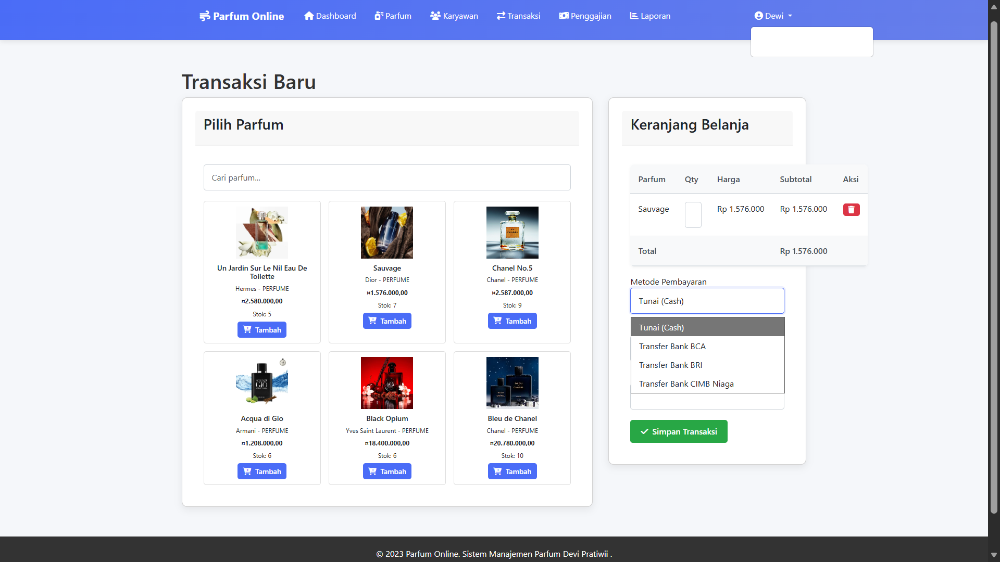

# 🎯 Parfum Online Management System

Sistem manajemen parfum online berbasis web yang dibangun dengan **Java Servlet, JSP, dan MySQL** menggunakan konsep Object-Oriented Programming (OOP).

## 🚀 Fitur Utama

### 👑 Admin Panel
- Manajemen Data Parfum (CRUD)
- Manajemen Karyawan
- Sistem Penggajian
- Laporan Penjualan & Stok
- Dashboard Admin

### 👨‍💼 Karyawan Panel
- Transaksi Penjualan
- View Produk Parfum
- Dashboard Karyawan
- Riwayat Transaksi

## 🛠️ Teknologi Stack

**Backend:**
- Java Servlet
- JSP & JSTL
- MySQL
- JasperReports

**Frontend:**
- HTML, CSS, JavaScript
- Bootstrap

---

---

## 📌 Catatan
Folder **Tangkapan_layar** berisi dokumentasi tampilan aplikasi sebagai pendukung penjelasan sistem.
